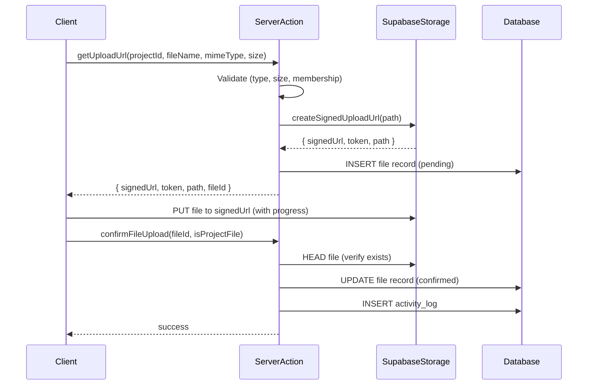

# Project Management System - Architecture Documentation

## Overview

This document describes the complete architecture for an internal Project Management System built with Next.js 14, TypeScript, Tailwind CSS, shadcn/ui, Supabase (PostgreSQL, Auth, Storage).

**Target Audience:** Senior Engineers, Architects, DevOps

**Architecture Style:** Feature-Based Architecture with strict Layer Separation (UI → Business Logic → Data Access)

---

## 1. High-Level Architecture

```
┌─────────────────────────────────────────────────────────────────────────────┐
│                              CLIENT (Browser)                               │
├─────────────────────────────────────────────────────────────────────────────┤
│  Next.js App Router (Server Components + Client Components)                │
│  ┌─────────────┐  ┌─────────────┐  ┌─────────────┐  ┌─────────────┐        │
│  │  Pages      │  │  Layouts    │  │  Components │  │  Client     │        │
│  │  (RSC)      │  │  (RSC)      │  │  (Shared)   │  │  Components │        │
│  └──────┬──────┘  └──────┬──────┘  └──────┬──────┘  └──────┬──────┘        │
│         │                │                │                │               │
│         ▼                ▼                ▼                ▼               │
│  ┌─────────────────────────────────────────────────────────────────────┐   │
│  │                    SERVER ACTIONS (Mutations)                       │   │
│  │  - Auth checks          - Authorization      - Validation           │   │
│  │  - Business logic       - Side effects       - Revalidation         │   │
│  └─────────────────────────────────────────────────────────────────────┘   │
│                              │                                            │
│                              ▼                                            │
│  ┌─────────────────────────────────────────────────────────────────────┐   │
│  │                    DATA ACCESS LAYER (Queries)                      │   │
│  │  - Supabase Server Client    - Type-safe queries                    │   │
│  │  - RLS enforcement           - Admin client for system ops          │   │
│  └─────────────────────────────────────────────────────────────────────┘   │
│                              │                                            │
└──────────────────────────────┼────────────────────────────────────────────┘
                               │
                               ▼
┌─────────────────────────────────────────────────────────────────────────────┐
│                           SUPABASE BACKEND                                  │
│  ┌─────────────┐  ┌─────────────┐  ┌─────────────┐  ┌─────────────┐        │
│  │  PostgreSQL │  │    Auth     │  │  Storage    │  │  Realtime   │        │
│  │  (RLS)      │  │  (JWT)      │  │  (Buckets)  │  │  (Optional) │        │
│  └─────────────┘  └─────────────┘  └─────────────┘  └─────────────┘        │
└─────────────────────────────────────────────────────────────────────────────┘
```

---

## 2. Feature-Based Folder Structure

```
src/
├── app/                          # Next.js App Router (Routes)
│   ├── [locale]/                 # Internationalized routes
│   │   ├── (auth)/               # Route group: auth pages (login, register)
│   │   │   ├── login/
│   │   │   └── register/
│   │   ├── (dashboard)/          # Route group: authenticated dashboard
│   │   │   ├── layout.tsx        # Dashboard layout with sidebar
│   │   │   ├── projects/         # Feature: Projects
│   │   │   │   ├── page.tsx              # Projects list (Server Component)
│   │   │   │   ├── CreateProjectButton.tsx
│   │   │   │   ├── ProjectsList.tsx
│   │   │   │   └── [id]/                 # Project detail routes
│   │   │   │       ├── layout.tsx        # Project layout with sidebar
│   │   │   │       ├── overview/
│   │   │   │       ├── tasks/
│   │   │   │       ├── members/
│   │   │   │       ├── files/
│   │   │   │       ├── activity/
│   │   │   │       └── settings/
│   │   │   ├── notifications/
│   │   │   └── profile/
│   │   ├── layout.tsx            # Root layout (providers, fonts)
│   │   └── page.tsx              # Landing page (redirects to dashboard)
│   ├── actions/                  # Server Actions (Mutations)
│   │   ├── projects.ts
│   │   ├── tasks.ts
│   │   ├── files.ts
│   │   ├── files-queries.ts      # Server Actions for data fetching
│   │   ├── notifications.ts
│   │   ├── members.ts
│   │   └── activity.ts
│   ├── api/                      # Route Handlers (Webhooks, Cron, SSE)
│   │   ├── notifications/
│   │   └── projects/[id]/activity/
│   └── globals.css
│
├── components/                   # Shared UI Components (Feature-agnostic)
│   ├── ui/                       # shadcn/ui base components
│   │   ├── button.tsx
│   │   ├── card.tsx
│   │   ├── dialog.tsx
│   │   └── ...
│   ├── theme-provider.tsx
│   ├── theme-switcher.tsx
│   ├── files/                    # Feature: Files (shared components)
│   │   ├── FileCard.tsx
│   │   ├── FileUpload.tsx
│   │   ├── FilePreview.tsx
│   │   ├── FilesLoadingSkeleton.tsx
│   │   └── FilesEmptyState.tsx
│   ├── tasks/                    # Feature: Tasks (shared components)
│   │   ├── TaskCard.tsx
│   │   ├── TaskKanbanBoard.tsx
│   │   ├── TasksFiltersClient.tsx
│   │   ├── TasksLoadingSkeleton.tsx
│   │   └── TasksEmptyState.tsx
│   ├── projects/                 # Feature: Projects (shared components)
│   │   ├── ProjectCard.tsx
│   │   ├── ProjectHeader.tsx
│   │   ├── ProjectSidebar.tsx
│   │   └── ...
│   ├── activity/                 # Feature: Activity
│   │   ├── ActivityTimeline.tsx
│   │   └── ActivityTimelineClient.tsx
│   ├── comments/                 # Feature: Comments
│   │   └── CommentSection.tsx
│   └── notifications/            # Feature: Notifications
│       ├── NotificationBell.tsx
│       └── NotificationItem.tsx
│
├── features/                     # Feature-Based Modules (Business Logic + UI)
│   ├── projects/
│   │   ├── components/           # Project-specific components
│   │   ├── hooks/                # Project-specific hooks
│   │   ├── utils/                # Project-specific utilities
│   │   └── types.ts              # Project-specific types (extends base types)
│   ├── tasks/
│   │   ├── components/
│   │   ├── hooks/
│   │   ├── utils/
│   │   └── types.ts
│   ├── files/
│   │   ├── components/
│   │   ├── hooks/
│   │   ├── utils/
│   │   └── types.ts
│   ├── members/
│   ├── notifications/
│   └── activity/
│
├── lib/                          # Core Libraries & Shared Utilities
│   ├── db/                       # Data Access Layer
│   │   ├── supabase-server.ts    # Server client factory (cached)
│   │   ├── supabase-client.ts    # Client-side Supabase client
│   │   └── queries/              # Server-side query functions
│   │       ├── projects.ts
│   │       ├── tasks.ts
│   │       ├── files.ts
│   │       ├── notes.ts
│   │       ├── members.ts
│   │       ├── notifications.ts
│   │       └── activity.ts
│   ├── utils.ts                  # Shared utilities (cn, formatters, validators)
│   ├── validations/              # Zod schemas (shared between client/server)
│   │   ├── project.ts
│   │   ├── task.ts
│   │   ├── file.ts
│   │   └── common.ts
│   └── constants.ts              # App-wide constants
│
├── shared/                       # Shared Cross-Cutting Concerns
│   ├── lib/
│   │   ├── supabase/
│   │   │   └── middleware.ts     # Auth middleware for session refresh
│   │   └── i18n/
│   │       ├── config.ts         # Locale config
│   │       ├── routing.ts        # next-intl routing
│   │       ├── formatters.ts     # Date/number/RTL formatters
│   │       └── index.ts
│   ├── hooks/                    # Shared React hooks
│   │   ├── use-toast.ts
│   │   ├── use-media-query.ts
│   │   └── use-debounce.ts
│   ├── types/                    # Shared TypeScript types
│   │   ├── project.ts            # All domain types (single source of truth)
│   │   ├── api.ts                # API response types
│   │   └── globals.d.ts
│   └── providers/                # React Context Providers
│       ├── AuthProvider.tsx
│       └── NotificationProvider.tsx
│
├── hooks/                        # Global custom hooks
│   ├── use-project.ts
│   ├── use-tasks.ts
│   └── use-auth.ts
│
├── types/                        # Global type exports (re-exports from shared)
│   └── index.ts
│
├── middleware.ts                 # Next.js Middleware (i18n + Auth)
├── i18n.ts                       # next-intl configuration entry
└── env.ts                        # Environment validation (Zod)
```

### Folder Structure Principles

| Principle | Implementation |
|-----------|----------------|
| **Feature-Based** | Each domain (projects, tasks, files, members) owns its components, hooks, types |
| **Layer Separation** | `lib/db/queries` = Data Access, `app/actions` = Business Logic, `components` = UI |
| **Colocation** | Feature-specific code lives with the feature; shared code in `lib/`, `components/`, `shared/` |
| **Server-First** | Default to Server Components; Client Components only when interactivity needed |
| **Type Safety** | Single source of truth in `shared/types/project.ts`; Zod for runtime validation |

---

## 3. Layer Responsibilities

### 3.1 UI Layer (Components)

**Location:** `components/`, `features/*/components/`, `app/[locale]/**/*.tsx` (Server Components)

**Responsibilities:**
- Render HTML/React elements
- Handle user interactions (clicks, inputs, drag-drop)
- Manage local UI state (open/closed, loading, form inputs)
- Consume data via props (Server Components) or hooks (Client Components)
- **NO** business logic, **NO** direct database calls, **NO** Supabase client

**Types:**
- **Server Components (RSC):** Default. Fetch data directly via query functions. No interactivity.
- **Client Components ('use client'):** Interactive (forms, modals, drag-drop, real-time). Receive data via props.

### 3.2 Business Logic Layer (Server Actions)

**Location:** `app/actions/*.ts`

**Responsibilities:**
- **Authorization** checks (user permissions, role verification)
- **Validation** (Zod schemas, business rules)
- **Orchestration** (multiple DB operations, side effects)
- **Activity Logging** (audit trail)
- **Notifications** (trigger creation)
- **Cache Revalidation** (`revalidatePath`, `revalidateTag`)
- **Error Handling** (structured error responses)
- **Transaction-like behavior** (compensating actions on failure)

**Rules:**
- `'use server'` directive at top
- Return structured `ActionResult<T>`: `{ success, data?, error?, code? }`
- Never expose Supabase client to UI
- Called from Client Components via form actions or direct invocation

### 3.3 Data Access Layer (Query Functions)

**Location:** `lib/db/queries/*.ts`

**Responsibilities:**
- **Pure data fetching/mutation** via Supabase
- **Type-safe** queries with full TypeScript inference
- **RLS-aware** - assumes caller is authenticated
- **No authorization logic** - that's Server Actions' job
- **No side effects** (no logging, no notifications, no revalidation)
- Return typed data or `PostgrestError`

**Naming Convention:**
- `get*` - fetch (list, single, stats)
- `create*` - insert
- `update*` - update
- `delete*` - soft delete (set `deleted_at`)
- `*Action` suffix for Server Actions only

---

## 4. Component Responsibilities Matrix

| Component Type | Location | Data Fetching | Mutations | Interactivity | Auth Check |
|----------------|----------|---------------|-----------|---------------|------------|
| **Server Component (Page/Layout)** | `app/[locale]/**/page.tsx` | Direct (query fns) | ❌ | ❌ | Via Middleware |
| **Server Component (Partial)** | `app/[locale]/**/*Content.tsx` | Direct (query fns) | ❌ | ❌ | Via Middleware |
| **Client Component (UI)** | `components/**/*.tsx` | Via props | Server Actions | ✅ | Via props/context |
| **Client Component (Interactive)** | `features/*/components/*.tsx` | Via props/hooks | Server Actions | ✅ | Via props/context |
| **Server Action** | `app/actions/*.ts` | Query functions | Supabase | ❌ | ✅ (explicit) |
| **Route Handler** | `app/api/**/route.ts` | Query functions | Supabase | ❌ | ✅ (explicit) |
| **Middleware** | `middleware.ts` | ❌ | ❌ | ❌ | ✅ (session refresh) |

---

## 5. Supabase Architecture

### 5.1 Client Strategy

```typescript
// lib/db/supabase-server.ts

// 1. Cached Server Client (Server Components, Server Actions)
// - Uses Next.js cookies() for session
// - Cached per request via React.cache()
// - Auto-refreshes session via middleware
export const createSupabaseServerClient = cache(async () => { ... })

// 2. Admin Client (Server Actions only, system operations)
// - Service role key (bypasses RLS)
// - NO cookies (stateless)
// - Used for: activity logs, notifications, cleanup, cron
export const createSupabaseAdminClient = () => { ... }

// 3. Browser Client (Client Components only)
// - @supabase/ssr with cookie handling
// - Created in shared/providers/AuthProvider.tsx
```

### 5.2 Storage Buckets

| Bucket | Purpose | Access Control | Path Structure |
|--------|---------|----------------|----------------|
| `project-files` | Shared project files | RLS on `project_files` table | `projects/{projectId}/{timestamp}-{filename}` |
| `user-files` | Private user files | RLS on `user_files` table | `users/{userId}/projects/{projectId}/{timestamp}-{filename}` |
| `avatars` | User avatars | Public read, auth write | `avatars/{userId}/{timestamp}-{filename}` |

### 5.3 Storage Security

- **Signed URLs only** - No public URLs for private files
- **Preview URLs** - Transform options for images (1200px max)
- **Download URLs** - 1-hour expiry
- **Upload URLs** - Direct to storage (bypass server), then confirm via Server Action
- **File validation** - MIME type + size checked in Server Action before upload URL creation

---

## 6. Authentication Architecture

### 6.1 Auth Flow

```
┌─────────┐     ┌──────────────┐     ┌─────────────┐     ┌─────────────┐
│ Browser │────▶│  Middleware  │────▶│  Supabase   │────▶│  Session    │
│ Request │     │ (i18n + SSR) │     │   SSR       │     │  Cookie     │
└─────────┘     └──────────────┘     └─────────────┘     └─────────────┘
       │                │                    │                   │
       │                ▼                    ▼                   │
       │         ┌──────────────┐     ┌─────────────┐           │
       │         │  Locale      │     │  Refresh    │           │
       │         │  Detection   │     │  if Expired │           │
       │         └──────────────┘     └─────────────┘           │
       │                                                    │
       ▼                                                    ▼
┌─────────────────────────────────────────────────────────────────┐
│                    Server Components                             │
│  - createSupabaseServerClient() → getUser()                     │
│  - Automatic session via cookies                                │
└─────────────────────────────────────────────────────────────────┘
```

### 6.2 Session Management

- **Middleware** (`middleware.ts`): Runs on every request, refreshes session via `@supabase/ssr`
- **Server Components**: Use `createSupabaseServerClient()` → `supabase.auth.getUser()`
- **Client Components**: Use `createBrowserClient()` from `@supabase/ssr` in `AuthProvider`
- **Server Actions**: Use `createSupabaseServerClient()` → `supabase.auth.getUser()`

### 6.3 Protected Routes

- **Middleware matcher**: All routes except `/api`, `/_next`, static assets
- **Route groups**: `(auth)` = public, `(dashboard)` = protected
- **Server Components**: Redirect to `/login` if no user (via `getUser()` check)

---

## 7. Authorization Architecture

### 7.1 Role Hierarchy

```
System Level:     ADMIN ──────────────────────────────────────▶ Full system access
                                                        │
Project Level:    OWNER ▶ ADMIN ▶ MEMBER ▶ VIEWER         │
     │                                                    │
     ├── OWNER: Full project control, delete project     │
     ├── ADMIN: Manage members, settings, all content    │
     ├── MEMBER: Create/edit tasks, upload files, comment│
     └── VIEWER: Read-only access to project content     │
                                                        ▼
Resource Level:   Task assignee/creator, File uploader, Note author
```

### 7.2 Permission Matrix

| Action | Admin | Owner | Admin | Member | Viewer | Assignee | Creator | Uploader | Author |
|--------|-------|-------|-------|--------|--------|----------|---------|----------|--------|
| **Projects** |
| Create project | ✅ | | | | | | | | |
| View project | ✅ | ✅ | ✅ | ✅ | ✅ | | | | |
| Update project | ✅ | ✅ | ✅ | | | | | | |
| Delete project | ✅ | ✅ | | | | | | | |
| **Members** |
| Invite member | ✅ | ✅ | ✅ | | | | | | |
| Change role | ✅ | ✅ | ✅* | | | | | | |
| Remove member | ✅ | ✅ | ✅* | | | | | | |
| **Tasks** |
| Create task | ✅ | ✅ | ✅ | ✅ | | | | | |
| View task | ✅ | ✅ | ✅ | ✅ | ✅ | ✅ | ✅ | | |
| Update task | ✅ | ✅ | ✅ | ✅ | | ✅ | ✅ | | |
| Delete task | ✅ | ✅ | ✅ | | | ✅ | ✅ | | |
| Change status | ✅ | ✅ | ✅ | ✅ | | ✅ | ✅ | | |
| Assign task | ✅ | ✅ | ✅ | | | | | | |
| **Files** |
| Upload project file | ✅ | ✅ | ✅ | ✅ | | | | | |
| Download project file | ✅ | ✅ | ✅ | ✅ | ✅ | | | | |
| Delete project file | ✅ | ✅ | ✅ | | | | | ✅ | |
| Upload user file | ✅ | ✅ | ✅ | ✅ | ✅ | | | | |
| Access user file | ✅ | | | | | | | | ✅ (owner only) |
| **Notes** |
| Create project note | ✅ | ✅ | ✅ | ✅ | | | | | |
| View project note | ✅ | ✅ | ✅ | ✅ | ✅ | | | | |
| Create user note | ✅ | ✅ | ✅ | ✅ | ✅ | | | | |
| Access user note | ✅ | | | | | | | | ✅ (owner only) |
| **Comments** |
| Create comment | ✅ | ✅ | ✅ | ✅ | ✅ | | | | |
| Edit own comment | ✅ | ✅ | ✅ | ✅ | ✅ | | | | |
| Delete any comment | ✅ | ✅ | ✅ | | | | | | |

*Admin cannot change Owner role or remove Owner

### 7.3 Authorization Implementation

**Server Actions** (Primary enforcement point):
```typescript
// app/actions/tasks.ts
export async function updateTask(taskId: string, input: UpdateTaskInput) {
  const user = await getCurrentUser()
  if (!user) return { success: false, error: 'Unauthorized', code: 'UNAUTHORIZED' }
  
  const canManage = await canManageTask(taskId, user.id)
  if (!canManage) return { success: false, error: 'Forbidden', code: 'FORBIDDEN' }
  
  // ... perform update
}
```

**Data Access Layer** (Query helpers for Server Actions):
```typescript
// lib/db/queries/tasks.ts
export async function canManageTask(taskId: string, userId: string): Promise<boolean> {
  const task = await getTaskBasic(taskId)
  const member = await getProjectMember(task.project_id, userId)
  return member && ['OWNER', 'ADMIN'].includes(member.role) 
    || task.assignee_id === userId 
    || task.created_by === userId
}
```

**RLS Policies** (Database-level enforcement - defense in depth):
```sql
-- See RLS section below
```

---

## 8. Permission System Design

### 8.1 Permission Model

```typescript
// shared/types/permissions.ts

export type SystemRole = 'ADMIN' | 'USER'
export type ProjectRole = 'OWNER' | 'ADMIN' | 'MEMBER' | 'VIEWER'

export type Permission = 
  | 'project:create'
  | 'project:read'
  | 'project:update'
  | 'project:delete'
  | 'project:manage_members'
  | 'project:manage_settings'
  | 'task:create'
  | 'task:read'
  | 'task:update'
  | 'task:delete'
  | 'task:assign'
  | 'task:change_status'
  | 'file:upload_project'
  | 'file:download_project'
  | 'file:delete_project'
  | 'file:upload_user'
  | 'file:access_user'
  | 'note:create_project'
  | 'note:read_project'
  | 'note:create_user'
  | 'note:access_user'
  | 'comment:create'
  | 'comment:update_own'
  | 'comment:delete_any'
  | 'member:invite'
  | 'member:update_role'
  | 'member:remove'
  | 'activity:read'
  | 'notification:read'
  | 'notification:manage'

// Role → Permissions mapping
export const ROLE_PERMISSIONS: Record<ProjectRole, Permission[]> = {
  OWNER: [/* all project permissions */],
  ADMIN: ['project:read', 'project:update', 'project:manage_members', 'project:manage_settings',
          'task:create', 'task:read', 'task:update', 'task:delete', 'task:assign', 'task:change_status',
          'file:upload_project', 'file:download_project', 'file:delete_project',
          'note:create_project', 'note:read_project',
          'comment:create', 'comment:update_own', 'comment:delete_any',
          'member:invite', 'member:update_role', 'member:remove',
          'activity:read', 'notification:read', 'notification:manage'],
  MEMBER: ['project:read',
           'task:create', 'task:read', 'task:update', 'task:change_status',
           'file:upload_project', 'file:download_project',
           'note:create_project', 'note:read_project',
           'comment:create', 'comment:update_own',
           'activity:read', 'notification:read'],
  VIEWER: ['project:read', 'task:read', 'file:download_project', 'note:read_project',
           'comment:create', 'comment:update_own', 'activity:read', 'notification:read'],
}
```

### 8.2 Permission Checking

```typescript
// shared/lib/auth/permissions.ts

export function hasPermission(role: ProjectRole, permission: Permission): boolean {
  return ROLE_PERMISSIONS[role]?.includes(permission) ?? false
}

export function hasAnyPermission(role: ProjectRole, permissions: Permission[]): boolean {
  return permissions.some(p => hasPermission(role, p))
}

export function hasAllPermissions(role: ProjectRole, permissions: Permission[]): boolean {
  return permissions.every(p => hasPermission(role, p))
}
```

### 8.3 Resource-Level Permissions

For fine-grained control (task assignee, file uploader, note author):

```typescript
// Server Action pattern
async function checkResourcePermission(
  userId: string,
  resource: { projectId: string; ownerId?: string; assigneeId?: string },
  requiredRole: ProjectRole[],
  resourceOwnerCheck?: (userId: string) => boolean
): Promise<boolean> {
  const projectRole = await getUserProjectRole(resource.projectId, userId)
  if (!projectRole) return false
  if (requiredRole.includes(projectRole)) return true
  if (resourceOwnerCheck && resourceOwnerCheck(userId)) return true
  return false
}
```

---

## 9. Supabase RLS (Row Level Security) Policies

### 9.1 RLS Philosophy

**Defense in Depth:** RLS is the **last line of defense**, not the only one.
- Primary: Server Action authorization checks
- Secondary: RLS policies on all tables
- RLS ensures data security even if Server Action has a bug

### 9.2 RLS Policy Patterns

```sql
-- Enable RLS on all tables
ALTER TABLE projects ENABLE ROW LEVEL SECURITY;
ALTER TABLE project_members ENABLE ROW LEVEL SECURITY;
ALTER TABLE tasks ENABLE ROW LEVEL SECURITY;
ALTER TABLE task_comments ENABLE ROW LEVEL SECURITY;
ALTER TABLE task_attachments ENABLE ROW LEVEL SECURITY;
ALTER TABLE project_files ENABLE ROW LEVEL SECURITY;
ALTER TABLE user_files ENABLE ROW LEVEL SECURITY;
ALTER TABLE project_notes ENABLE ROW LEVEL SECURITY;
ALTER TABLE user_notes ENABLE ROW LEVEL SECURITY;
ALTER TABLE notifications ENABLE ROW LEVEL SECURITY;
ALTER TABLE activity_logs ENABLE ROW LEVEL SECURITY;
ALTER TABLE profiles ENABLE ROW LEVEL SECURITY;

-- Helper function for project membership
CREATE OR REPLACE FUNCTION is_project_member(project_uuid UUID, user_uuid UUID)
RETURNS BOOLEAN AS $$
  SELECT EXISTS (
    SELECT 1 FROM project_members
    WHERE project_id = project_uuid
    AND user_id = user_uuid
    AND deleted_at IS NULL
  );
$$ LANGUAGE sql SECURITY DEFINER;

-- Helper function for project role
CREATE OR REPLACE FUNCTION get_project_role(project_uuid UUID, user_uuid UUID)
RETURNS TEXT AS $$
  SELECT role FROM project_members
  WHERE project_id = project_uuid
  AND user_id = user_uuid
  AND deleted_at IS NULL
  LIMIT 1;
$$ LANGUAGE sql SECURITY DEFINER;

-- ==================== PROJECTS ====================
-- Users can see projects they own or are members of
CREATE POLICY "projects_select_member" ON projects
  FOR SELECT USING (
    owner_id = auth.uid() OR 
    is_project_member(id, auth.uid())
  );

-- Only owners can create (handled by Server Action, but RLS as backup)
CREATE POLICY "projects_insert_owner" ON projects
  FOR INSERT WITH CHECK (owner_id = auth.uid());

-- Owner/Admin can update
CREATE POLICY "projects_update_admin" ON projects
  FOR UPDATE USING (
    owner_id = auth.uid() OR
    get_project_role(id, auth.uid()) IN ('OWNER', 'ADMIN')
  );

-- Owner can delete (soft delete)
CREATE POLICY "projects_delete_owner" ON projects
  FOR UPDATE USING (owner_id = auth.uid());

-- ==================== PROJECT MEMBERS ====================
-- Members can view project members
CREATE POLICY "project_members_select" ON project_members
  FOR SELECT USING (
    is_project_member(project_id, auth.uid())
  );

-- Owner/Admin can invite
CREATE POLICY "project_members_insert_admin" ON project_members
  FOR INSERT WITH CHECK (
    get_project_role(project_id, auth.uid()) IN ('OWNER', 'ADMIN')
  );

-- Owner/Admin can update roles
CREATE POLICY "project_members_update_admin" ON project_members
  FOR UPDATE USING (
    get_project_role(project_id, auth.uid()) IN ('OWNER', 'ADMIN')
  );

-- Owner/Admin can remove members (soft delete via role change or actual delete)
CREATE POLICY "project_members_delete_admin" ON project_members
  FOR DELETE USING (
    get_project_role(project_id, auth.uid()) IN ('OWNER', 'ADMIN')
    AND user_id != auth.uid() -- Can't remove self
  );

-- ==================== TASKS ====================
-- Members can view tasks in their projects
CREATE POLICY "tasks_select_member" ON tasks
  FOR SELECT USING (
    is_project_member(project_id, auth.uid())
  );

-- Members can create tasks
CREATE POLICY "tasks_insert_member" ON tasks
  FOR INSERT WITH CHECK (
    is_project_member(project_id, auth.uid())
    AND created_by = auth.uid()
  );

-- Owner/Admin/Assignee/Creator can update
CREATE POLICY "tasks_update_permitted" ON tasks
  FOR UPDATE USING (
    get_project_role(project_id, auth.uid()) IN ('OWNER', 'ADMIN')
    OR assignee_id = auth.uid()
    OR created_by = auth.uid()
  );

-- Owner/Admin/Assignee/Creator can soft delete
CREATE POLICY "tasks_delete_permitted" ON tasks
  FOR UPDATE USING (
    get_project_role(project_id, auth.uid()) IN ('OWNER', 'ADMIN')
    OR assignee_id = auth.uid()
    OR created_by = auth.uid()
  );

-- ==================== PROJECT FILES (Shared) ====================
-- Members can view
CREATE POLICY "project_files_select_member" ON project_files
  FOR SELECT USING (
    is_project_member(project_id, auth.uid())
  );

-- Members can upload
CREATE POLICY "project_files_insert_member" ON project_files
  FOR INSERT WITH CHECK (
    is_project_member(project_id, auth.uid())
    AND uploaded_by = auth.uid()
  );

-- Owner/Admin/Uploader can update metadata
CREATE POLICY "project_files_update_permitted" ON project_files
  FOR UPDATE USING (
    get_project_role(project_id, auth.uid()) IN ('OWNER', 'ADMIN')
    OR uploaded_by = auth.uid()
  );

-- Owner/Admin/Uploader can soft delete
CREATE POLICY "project_files_delete_permitted" ON project_files
  FOR UPDATE USING (
    get_project_role(project_id, auth.uid()) IN ('OWNER', 'ADMIN')
    OR uploaded_by = auth.uid()
  );

-- ==================== USER FILES (Private) ====================
-- ONLY the owner can access their own files
CREATE POLICY "user_files_select_owner" ON user_files
  FOR SELECT USING (user_id = auth.uid());

CREATE POLICY "user_files_insert_owner" ON user_files
  FOR INSERT WITH CHECK (user_id = auth.uid());

CREATE POLICY "user_files_update_owner" ON user_files
  FOR UPDATE USING (user_id = auth.uid());

CREATE POLICY "user_files_delete_owner" ON user_files
  FOR UPDATE USING (user_id = auth.uid());

-- ==================== PROJECT NOTES (Shared) ====================
-- Members can view
CREATE POLICY "project_notes_select_member" ON project_notes
  FOR SELECT USING (
    is_project_member(project_id, auth.uid())
  );

-- Members can create
CREATE POLICY "project_notes_insert_member" ON project_notes
  FOR INSERT WITH CHECK (
    is_project_member(project_id, auth.uid())
    AND author_id = auth.uid()
  );

-- Author/Owner/Admin can update
CREATE POLICY "project_notes_update_permitted" ON project_notes
  FOR UPDATE USING (
    author_id = auth.uid()
    OR get_project_role(project_id, auth.uid()) IN ('OWNER', 'ADMIN')
  );

-- Author/Owner/Admin can soft delete
CREATE POLICY "project_notes_delete_permitted" ON project_notes
  FOR UPDATE USING (
    author_id = auth.uid()
    OR get_project_role(project_id, auth.uid()) IN ('OWNER', 'ADMIN')
  );

-- ==================== USER NOTES (Private) ====================
-- ONLY the owner can access
CREATE POLICY "user_notes_select_owner" ON user_notes
  FOR SELECT USING (user_id = auth.uid());

CREATE POLICY "user_notes_insert_owner" ON user_notes
  FOR INSERT WITH CHECK (user_id = auth.uid());

CREATE POLICY "user_notes_update_owner" ON user_notes
  FOR UPDATE USING (user_id = auth.uid());

CREATE POLICY "user_notes_delete_owner" ON user_notes
  FOR UPDATE USING (user_id = auth.uid());

-- ==================== NOTIFICATIONS ====================
-- Users can only see their own notifications
CREATE POLICY "notifications_select_owner" ON notifications
  FOR SELECT USING (user_id = auth.uid());

-- System (admin client) inserts notifications
CREATE POLICY "notifications_insert_system" ON notifications
  FOR INSERT WITH CHECK (true); -- Only admin client bypasses RLS

-- Users can mark their own as read
CREATE POLICY "notifications_update_owner" ON notifications
  FOR UPDATE USING (user_id = auth.uid());

-- ==================== ACTIVITY LOGS ====================
-- Project members can view project activity
CREATE POLICY "activity_logs_select_member" ON activity_logs
  FOR SELECT USING (
    project_id IS NULL OR is_project_member(project_id, auth.uid())
  );

-- System (admin client) inserts activity
CREATE POLICY "activity_logs_insert_system" ON activity_logs
  FOR INSERT WITH CHECK (true);

-- ==================== PROFILES ====================
-- Users can view all profiles (for member lists, assignees)
CREATE POLICY "profiles_select_all" ON profiles
  FOR SELECT USING (true);

-- Users can update their own profile
CREATE POLICY "profiles_update_own" ON profiles
  FOR UPDATE USING (id = auth.uid());
```

### 9.3 Storage RLS Policies

```sql
-- project-files bucket
CREATE POLICY "project_files_select" ON storage.objects
  FOR SELECT USING (
    bucket_id = 'project-files' AND
    (storage.foldername(name))[1] = 'projects' AND
    is_project_member((storage.foldername(name))[2]::UUID, auth.uid())
  );

CREATE POLICY "project_files_insert" ON storage.objects
  FOR INSERT WITH CHECK (
    bucket_id = 'project-files' AND
    (storage.foldername(name))[1] = 'projects' AND
    is_project_member((storage.foldername(name))[2]::UUID, auth.uid())
  );

CREATE POLICY "project_files_update" ON storage.objects
  FOR UPDATE USING (
    bucket_id = 'project-files' AND
    (storage.foldername(name))[1] = 'projects' AND
    (
      get_project_role((storage.foldername(name))[2]::UUID, auth.uid()) IN ('OWNER', 'ADMIN')
      OR owner = auth.uid()
    )
  );

CREATE POLICY "project_files_delete" ON storage.objects
  FOR DELETE USING (
    bucket_id = 'project-files' AND
    (storage.foldername(name))[1] = 'projects' AND
    (
      get_project_role((storage.foldername(name))[2]::UUID, auth.uid()) IN ('OWNER', 'ADMIN')
      OR owner = auth.uid()
    )
  );

-- user-files bucket (strictly private)
CREATE POLICY "user_files_select" ON storage.objects
  FOR SELECT USING (
    bucket_id = 'user-files' AND
    (storage.foldername(name))[1] = 'users' AND
    (storage.foldername(name))[2] = auth.uid()::TEXT
  );

CREATE POLICY "user_files_insert" ON storage.objects
  FOR INSERT WITH CHECK (
    bucket_id = 'user-files' AND
    (storage.foldername(name))[1] = 'users' AND
    (storage.foldername(name))[2] = auth.uid()::TEXT
  );

CREATE POLICY "user_files_update" ON storage.objects
  FOR UPDATE USING (
    bucket_id = 'user-files' AND
    (storage.foldername(name))[1] = 'users' AND
    (storage.foldername(name))[2] = auth.uid()::TEXT
  );

CREATE POLICY "user_files_delete" ON storage.objects
  FOR DELETE USING (
    bucket_id = 'user-files' AND
    (storage.foldername(name))[1] = 'users' AND
    (storage.foldername(name))[2] = auth.uid()::TEXT
  );
```

---

## 10. Private vs Public File Handling

### 10.1 File Types

| Type | Table | Bucket | Visibility | Access Control |
|------|-------|--------|------------|----------------|
| **Project File** | `project_files` | `project-files` | Shared with project members | Project membership + role |
| **User File** | `user_files` | `user-files` | Private to user only | Owner only (user_id match) |
| **Task Attachment** | `task_attachments` + `project_files` | `project-files` | Same as project file | Via project file permissions |
| **Avatar** | `profiles.avatar_url` | `avatars` | Public | Public read |

### 10.2 Upload Flow (Direct to Storage)



### 10.3 Download/Preview Flow

```typescript
// Server Action - getProjectFileDownloadUrl(fileId)
1. Get current user
2. Check canAccessProjectFile(fileId, userId) → project membership
3. Create signed download URL (1hr expiry)
4. Log activity (FILE_DOWNLOADED)
5. Return signed URL

// Server Action - getProjectFilePreviewUrl(fileId)
1. Check access (same as download)
2. Check previewable type (image/*, application/pdf)
3. Create signed URL with transform (1200px, quality 80)
4. Return signed URL
```

### 10.4 Key Security Rules

- **NEVER** use public URLs for private files
- **ALWAYS** verify project membership before generating signed URLs
- **User files** are strictly isolated by `user_id` in both DB and Storage path
- **Upload validation** happens in Server Action BEFORE creating upload URL
- **Confirmation step** verifies file actually uploaded before marking complete

---

## 11. Internationalization (i18n) - Arabic/English & RTL/LTR

### 11.1 Configuration

```typescript
// shared/lib/i18n/config.ts
export const LOCALES = ['en', 'ar'] as const;
export type Locale = typeof LOCALES[number];
export const DEFAULT_LOCALE: Locale = 'en';

export const LOCALE_DIR: Record<Locale, 'ltr' | 'rtl'> = {
  en: 'ltr',
  ar: 'rtl',
};
```

### 11.2 Routing (next-intl v3)

```typescript
// shared/lib/i18n/routing.ts
export const routing = {
  locales: LOCALES,
  defaultLocale: DEFAULT_LOCALE,
  localePrefix: 'always', // /en/dashboard, /ar/dashboard
  pathnames: {
    '/projects/[projectId]/tasks': '/projects/[projectId]/tasks',
    // ... all routes
  },
} as const;
```

### 11.3 RTL Implementation

**CSS (Tailwind + CSS Variables):**
```css
/* globals.css */
:root {
  --direction: ltr;
}

[dir="rtl"] {
  --direction: rtl;
}

/* Logical properties for RTL support */
.margin-start { margin-inline-start: var(--spacing); }
.margin-end { margin-inline-end: var(--spacing); }
.padding-start { padding-inline-start: var(--spacing); }
.padding-end { padding-inline-end: var(--spacing); }
.float-start { float: inline-start; }
.float-end { float: inline-end; }
.text-start { text-align: start; }
.text-end { text-align: end; }

/* Flexbox/Grid automatically handle RTL with dir attribute */
```

**HTML:**
```tsx
// app/[locale]/layout.tsx
<html lang={locale} dir={LOCALE_DIR[locale]}>
```

**Component Usage:**
```tsx
// Use logical properties instead of left/right
<div className="ms-4 me-2"> {/* margin-inline-start/end */}
<div className="ps-4 pe-2"> {/* padding-inline-start/end */}
<div className="flex-row-reverse"> {/* Only if explicit reversal needed */}

// Icons that need mirroring
<ChevronLeft className={locale === 'ar' ? 'rotate-180' : ''} />
```

### 11.4 Translation Files

```
src/messages/
├── en.json
└── ar.json
```

```json
// en.json
{
  "projects": {
    "title": "Projects",
    "create": "Create Project",
    "noProjects": "No projects yet"
  },
  "tasks": {
    "status": {
      "TODO": "To Do",
      "IN_PROGRESS": "In Progress",
      "REVIEW": "Review",
      "BLOCKED": "Blocked",
      "COMPLETED": "Completed"
    }
  },
  "files": {
    "upload": "Upload File",
    "maxSize": "Max 50MB",
    "allowedTypes": "PDF, PNG, JPG, WEBP, DOCX, XLSX, ZIP"
  },
  "common": {
    "save": "Save",
    "cancel": "Cancel",
    "delete": "Delete",
    "confirm": "Confirm",
    "loading": "Loading...",
    "error": "An error occurred"
  }
}
```

### 11.5 Date/Number Formatting

```typescript
// shared/lib/i18n/formatters.ts
export function formatDate(date: Date | string, locale: Locale): string
export function formatRelativeTime(date: Date | string, locale: Locale): string
export function formatNumber(num: number, locale: Locale): string
export function getDirection(locale: Locale): 'ltr' | 'rtl'
```

---

## 12. Dark/Light Mode

### 12.1 Implementation (next-themes)

```typescript
// components/theme-provider.tsx
import { ThemeProvider as NextThemesProvider } from 'next-themes';

export function ThemeProvider({ children, ...props }) {
  return (
    <NextThemesProvider 
      attribute="class" 
      defaultTheme="system" 
      enableSystem
      disableTransitionOnChange
      {...props}
    >
      {children}
    </NextThemesProvider>
  );
}
```

### 12.2 Tailwind Configuration

```typescript
// tailwind.config.ts
export default {
  darkMode: 'class',
  // ...
}
```

### 12.3 Theme Switcher Component

```tsx
// components/theme-switcher.tsx
'use client';
import { useTheme } from 'next-themes';

export function ThemeSwitcher() {
  const { theme, setTheme } = useTheme();
  return (
    <DropdownMenu>
      <DropdownMenuTrigger asChild>
        <Button variant="ghost" size="icon">
          <Sun className="h-5 w-5 rotate-0 scale-100 transition-all dark:-rotate-90 dark:scale-0" />
          <Moon className="absolute h-5 w-5 rotate-90 scale-0 transition-all dark:rotate-0 dark:scale-100" />
        </Button>
      </DropdownMenuTrigger>
      <DropdownMenuContent align="end">
        <DropdownMenuItem onClick={() => setTheme('light')}>Light</DropdownMenuItem>
        <DropdownMenuItem onClick={() => setTheme('dark')}>Dark</DropdownMenuItem>
        <DropdownMenuItem onClick={() => setTheme('system')}>System</DropdownMenuItem>
      </DropdownMenuContent>
    </DropdownMenu>
  );
}
```

### 12.4 Persistence

- Stored in `localStorage` (via next-themes)
- Synced to `profiles.theme` in database on change
- Server Components read from cookie/header for initial render

---

## 13. Error Handling Strategy

### 13.1 Error Types

```typescript
// shared/types/api.ts

export class AppError extends Error {
  constructor(
    public readonly code: string,
    message: string,
    public readonly statusCode: number = 500,
    public readonly details?: Record<string, unknown>
  ) {
    super(message);
    this.name = 'AppError';
  }
}

export class ValidationError extends AppError {
  constructor(message: string, public readonly fields: Record<string, string[]>) {
    super('VALIDATION_ERROR', message, 400, { fields });
  }
}

export class AuthorizationError extends AppError {
  constructor(message = 'Forbidden') {
    super('FORBIDDEN', message, 403);
  }
}

export class NotFoundError extends AppError {
  constructor(resource: string) {
    super('NOT_FOUND', `${resource} not found`, 404);
  }
}
```

### 13.2 Server Action Error Responses

```typescript
// Standardized result type
export interface ActionResult<T = unknown> {
  success: boolean;
  data?: T;
  error?: string;
  code?: string;
  fieldErrors?: Record<string, string[]>;
}

// Usage
export async function createProject(input: CreateProjectInput): Promise<ActionResult<Project>> {
  try {
    // Validation
    const validated = createProjectSchema.parse(input);
    
    // Auth
    const user = await getCurrentUser();
    if (!user) return { success: false, error: 'Unauthorized', code: 'UNAUTHORIZED' };
    
    // Business logic
    const { data, error } = await createProjectQuery(validated);
    if (error) throw new AppError(error.code, error.message);
    
    // Side effects
    await logActivity(...);
    revalidatePath('/projects');
    
    return { success: true, data };
  } catch (err) {
    if (err instanceof z.ZodError) {
      return { 
        success: false, 
        error: 'Validation failed', 
        code: 'VALIDATION_ERROR',
        fieldErrors: err.flatten().fieldErrors 
      };
    }
    if (err instanceof AppError) {
      return { success: false, error: err.message, code: err.code };
    }
    console.error('createProject error:', err);
    return { success: false, error: 'Internal server error', code: 'INTERNAL_ERROR' };
  }
}
```

### 13.3 Client-Side Error Handling

```tsx
// Toast notifications (sonner)
import { toast } from 'sonner';

const result = await createProjectAction(formData);
if (!result.success) {
  if (result.code === 'VALIDATION_ERROR' && result.fieldErrors) {
    // Show field errors inline
    Object.entries(result.fieldErrors).forEach(([field, messages]) => {
      messages.forEach(msg => toast.error(`${field}: ${msg}`));
    });
  } else {
    toast.error(result.error || 'Something went wrong');
  }
  return;
}
toast.success('Project created!');
```

### 13.4 Global Error Boundary

```tsx
// app/[locale]/(dashboard)/error.tsx
'use client';
export default function Error({ error, reset }: { error: Error; reset: () => void }) {
  return (
    <div className="flex h-full items-center justify-center">
      <div className="text-center">
        <h2 className="text-2xl font-bold">Something went wrong</h2>
        <p className="text-muted-foreground mt-2">{error.message}</p>
        <Button onClick={reset} className="mt-4">Try again</Button>
      </div>
    </div>
  );
}
```

---

## 14. Validation Strategy

### 14.1 Zod Schemas (Shared)

```typescript
// lib/validations/project.ts
import { z } from 'zod';

export const createProjectSchema = z.object({
  name: z.string().min(1, 'Name is required').max(100, 'Name too long'),
  key: z.string().min(2, 'Key must be at least 2 chars').max(10).toUpperCase(),
  description: z.string().max(1000).optional(),
});

export const updateProjectSchema = z.object({
  name: z.string().min(1).max(100).optional(),
  description: z.string().max(1000).nullable().optional(),
  status: z.enum(['ACTIVE', 'ARCHIVED', 'ON_HOLD']).optional(),
});

export type CreateProjectInput = z.infer<typeof createProjectSchema>;
export type UpdateProjectInput = z.infer<typeof updateProjectSchema>;
```

### 14.2 Validation Layers

| Layer | Purpose | Implementation |
|-------|---------|----------------|
| **Client (Form)** | Immediate UX feedback | React Hook Form + Zod resolver |
| **Server Action** | Security, business rules | Zod parse + custom checks |
| **Database** | Data integrity | Constraints, checks, triggers |
| **RLS** | Access control | PostgreSQL policies |

### 14.3 Client-Side Form Validation

```tsx
// Client Component
import { useForm } from 'react-hook-form';
import { zodResolver } from '@hookform/resolvers/zod';
import { createProjectSchema } from '@/lib/validations/project';

const form = useForm<CreateProjectInput>({
  resolver: zodResolver(createProjectSchema),
  defaultValues: { name: '', key: '', description: '' },
});

const onSubmit = async (data: CreateProjectInput) => {
  const result = await createProjectAction(data);
  if (!result.success) {
    if (result.fieldErrors) {
      Object.entries(result.fieldErrors).forEach(([field, messages]) => {
        messages.forEach(msg => form.setError(field as keyof CreateProjectInput, { message: msg }));
      });
    }
    return;
  }
  router.push(`/projects/${result.data.id}`);
};
```

---

## 15. Loading States

### 15.1 Server Component Loading (Streaming)

```tsx
// app/[locale]/(dashboard)/projects/[id]/page.tsx
import { Suspense } from 'react';
import { ProjectHeader } from '@/components/projects/ProjectHeader';
import { ProjectSidebar } from '@/components/projects/ProjectSidebar';
import { ProjectOverviewContent } from '@/components/projects/ProjectOverviewContent';
import { ProjectsLoadingSkeleton } from '@/components/projects/ProjectsLoadingSkeleton';

export default async function ProjectPage({ params }: { params: { id: string } }) {
  return (
    <div className="flex h-full">
      <Suspense fallback={<ProjectSidebarSkeleton />}>
        <ProjectSidebar projectId={params.id} />
      </Suspense>
      <div className="flex-1 flex flex-col">
        <Suspense fallback={<div className="h-16 animate-pulse bg-muted" />}>
          <ProjectHeader projectId={params.id} />
        </Suspense>
        <Suspense fallback={<ProjectsLoadingSkeleton />}>
          <ProjectOverviewContent projectId={params.id} />
        </Suspense>
      </div>
    </div>
  );
}
```

### 15.2 Client Component Loading

```tsx
// components/tasks/TaskKanbanBoardContainer.tsx
'use client';

export function TaskKanbanBoardContainer({ projectId }: { projectId: string }) {
  const [tasks, setTasks] = useState<TaskColumn[]>([]);
  const [isLoading, setIsLoading] = useState(true);
  const [error, setError] = useState<string | null>(null);

  useEffect(() => {
    fetchTasks();
  }, [projectId]);

  const fetchTasks = async () => {
    setIsLoading(true);
    try {
      const result = await getTasksForKanbanAction(projectId);
      if (result.success) setTasks(result.data);
      else throw new Error(result.error);
    } catch (err) {
      setError(err.message);
    } finally {
      setIsLoading(false);
    }
  };

  if (isLoading) return <TasksLoadingSkeleton columns={5} />;
  if (error) return <TasksErrorState error={error} onRetry={fetchTasks} />;
  
  return <TaskKanbanBoard columns={tasks} />;
}
```

### 15.3 Skeleton Components

```tsx
// components/projects/ProjectsLoadingSkeleton.tsx
export function ProjectsLoadingSkeleton({ count = 4 }: { count?: number }) {
  return (
    <div className="grid gap-4 sm:grid-cols-2 lg:grid-cols-3 xl:grid-cols-4">
      {Array.from({ length: count }).map((_, i) => (
        <div key={i} className="p-4 bg-card border rounded-xl animate-pulse">
          <div className="h-6 w-3/4 bg-muted rounded mb-2" />
          <div className="h-4 w-1/2 bg-muted rounded mb-4" />
          <div className="h-4 w-full bg-muted rounded mb-2" />
          <div className="h-4 w-2/3 bg-muted rounded" />
        </div>
      ))}
    </div>
  );
}
```

---

## 16. Empty States

### 16.1 Empty State Component Pattern

```tsx
// components/files/FilesEmptyState.tsx
interface FilesEmptyStateProps {
  title: string;
  description: string;
  actionLabel?: string;
  onAction?: () => void;
  icon?: React.ReactNode;
}

export function FilesEmptyState({ 
  title, 
  description, 
  actionLabel, 
  onAction, 
  icon = <Folder className="h-12 w-12" /> 
}: FilesEmptyStateProps) {
  return (
    <div className="flex flex-col items-center justify-center py-12 text-center">
      <div className="mx-auto text-muted-foreground/50 mb-4">{icon}</div>
      <h3 className="text-lg font-medium">{title}</h3>
      <p className="text-muted-foreground mt-1 max-w-sm">{description}</p>
      {actionLabel && onAction && (
        <Button className="mt-4" onClick={onAction}>
          {actionLabel}
        </Button>
      )}
    </div>
  );
}
```

### 16.2 Usage in Features

```tsx
// files-client.tsx
{filteredProjectFiles.length === 0 && pagination.page === 1 ? (
  <FilesEmptyState
    title={t('files.noFiles')}
    description={t('files.noFilesDescription')}
    actionLabel={t('files.uploadFile')}
    onAction={() => setShowUpload(true)}
    icon={<Upload className="mx-auto h-12 w-12 text-muted-foreground/50 mb-4" />}
  />
) : (
  // File list
)}
```

---

## 17. Activity Logging Architecture

### 17.1 Event Model

```typescript
// shared/types/project.ts
export type ActivityAction =
  | 'PROJECT_CREATED' | 'PROJECT_UPDATED' | 'PROJECT_ARCHIVED' | 'PROJECT_DELETED'
  | 'TASK_CREATED' | 'TASK_UPDATED' | 'TASK_STATUS_CHANGED' | 'TASK_ASSIGNED'
  | 'TASK_PRIORITY_CHANGED' | 'TASK_DELETED'
  | 'MEMBER_INVITED' | 'MEMBER_JOINED' | 'MEMBER_ROLE_CHANGED' | 'MEMBER_REMOVED'
  | 'FILE_UPLOADED' | 'FILE_DOWNLOADED' | 'FILE_DELETED'
  | 'NOTE_CREATED' | 'NOTE_UPDATED' | 'NOTE_DELETED' | 'NOTE_PRIVACY_CHANGED'
  | 'COMMENT_CREATED' | 'COMMENT_UPDATED' | 'COMMENT_DELETED'
  | 'USER_PROFILE_UPDATED' | 'USER_AVATAR_CHANGED'
  | 'USER_LOGIN' | 'USER_LOGOUT' | 'PASSWORD_RESET_REQUESTED' | 'PASSWORD_RESET';

export type EntityType = 'project' | 'task' | 'member' | 'file' | 'note' | 'comment' | 'user';
```

### 17.2 Logging Implementation

```typescript
// lib/db/queries/activity.ts
export async function logActivity(input: {
  project_id: string | null;
  user_id: string | null;
  action: ActivityAction;
  entity_type: EntityType;
  entity_id: string;
  metadata?: Record<string, unknown>;
  ip_address?: string | null;
  user_agent?: string | null;
}): Promise<{ data: ActivityLog | null; error: PostgrestError | null }> {
  // Uses ADMIN client to bypass RLS for system logging
  const adminClient = createSupabaseAdminClient();
  
  const { data, error } = await adminClient
    .from('activity_logs')
    .insert({
      project_id: input.project_id,
      user_id: input.user_id,
      action: input.action,
      entity_type: input.entity_type,
      entity_id: input.entity_id,
      metadata: input.metadata || {},
      ip_address: input.ip_address || null,
      user_agent: input.user_agent || null,
    })
    .select()
    .single();

  return { data, error };
}
```

### 17.3 Usage in Server Actions

```typescript
// app/actions/tasks.ts
import { logActivity } from '@/lib/db/queries/activity';

export async function updateTask(taskId: string, input: UpdateTaskInput) {
  // ... authorization, validation ...
  
  const { data, error } = await updateTaskQuery(taskId, input);
  if (error) throw error;
  
  // Log activity (fire-and-forget, non-blocking)
  logActivity({
    project_id: data.project_id,
    user_id: user.id,
    action: 'TASK_UPDATED',
    entity_type: 'task',
    entity_id: taskId,
    metadata: { changed_fields: Object.keys(input) },
  }).catch(console.error); // Don't fail the action if logging fails
  
  revalidatePath(`/projects/${data.project_id}/tasks`);
  return { success: true, data };
}
```

### 17.4 Activity Feed Display

```tsx
// components/activity/ActivityTimelineClient.tsx
'use client';

export function ActivityTimelineClient({ projectId }: { projectId: string }) {
  const [activities, setActivities] = useState<ActivityLogWithUser[]>([]);
  const [page, setPage] = useState(1);
  const [hasMore, setHasMore] = useState(true);
  const [isLoading, setIsLoading] = useState(false);

  const loadMore = async () => {
    setIsLoading(true);
    const result = await getActivityLogsAction({ project_id: projectId, page });
    if (result.success) {
      setActivities(prev => [...prev, ...result.data]);
      setHasMore(result.data.length === 20);
      setPage(p => p + 1);
    }
    setIsLoading(false);
  };

  return (
    <div className="space-y-4">
      {activities.map(activity => (
        <ActivityItem key={activity.id} activity={activity} />
      ))}
      {hasMore && (
        <Button variant="outline" className="w-full" onClick={loadMore} disabled={isLoading}>
          {isLoading ? 'Loading...' : 'Load More'}
        </Button>
      )}
    </div>
  );
}
```

---

## 18. Notifications Architecture

### 18.1 Notification Types

```typescript
// shared/types/project.ts
export type NotificationType =
  | 'MENTION'
  | 'TASK_ASSIGNED'
  | 'TASK_UPDATED'
  | 'TASK_STATUS_CHANGED'
  | 'TASK_COMMENT'
  | 'TASK_DUE_SOON'
  | 'TASK_OVERDUE'
  | 'PROJECT_INVITE'
  | 'PROJECT_UPDATED'
  | 'MEMBER_ADDED'
  | 'MEMBER_ROLE_CHANGED'
  | 'FILE_UPLOADED'
  | 'NOTE_CREATED'
  | 'NOTE_COMMENT'
  | 'NOTE_MENTION'
  | 'SYSTEM_ALERT';
```

### 18.2 Notification Creation

```typescript
// lib/db/queries/notifications.ts
export async function createNotificationsForUsers(input: {
  user_ids: string[];
  project_id?: string | null;
  type: NotificationType;
  title: string;
  message: string;
  action_url?: string | null;
  action_label?: string | null;
  metadata?: Record<string, unknown>;
}): Promise<{ data: Notification[] | null; error: PostgrestError | null }> {
  // Uses ADMIN client to bypass RLS
  const adminClient = createSupabaseAdminClient();
  
  // Deduplication: prevent spam within 1 minute
  const recentThreshold = new Date(Date.now() - 60000).toISOString();
  // ... check recent notifications ...
  
  const { data, error } = await adminClient
    .from('notifications')
    .insert(notificationsToInsert)
    .select();
  
  return { data, error };
}
```

### 18.3 Trigger Points (Server Actions)

```typescript
// app/actions/tasks.ts
export async function createTask(input: CreateTaskInput) {
  // ... create task ...
  
  // Notify assignee
  if (data.assignee_id && data.assignee_id !== user.id) {
    await createNotificationsForUsers({
      user_ids: [data.assignee_id],
      project_id: data.project_id,
      type: 'TASK_ASSIGNED',
      title: 'New Task Assigned',
      message: `${user.full_name} assigned you to "${data.title}"`,
      action_url: `/projects/${data.project_id}/tasks/${data.id}`,
      action_label: 'View Task',
    });
  }
  
  // Notify project members (optional, for high priority)
  if (input.priority === 'URGENT' || input.priority === 'HIGH') {
    const members = await getProjectMemberIds(data.project_id);
    const otherMembers = members.filter(id => id !== user.id && id !== data.assignee_id);
    if (otherMembers.length > 0) {
      await createNotificationsForUsers({
        user_ids: otherMembers,
        project_id: data.project_id,
        type: 'TASK_CREATED',
        title: 'High Priority Task Created',
        message: `${user.full_name} created "${data.title}"`,
        action_url: `/projects/${data.project_id}/tasks/${data.id}`,
      });
    }
  }
}
```

### 18.4 Real-time Delivery (Optional)

```typescript
// For future enhancement: Supabase Realtime
// components/notifications/NotificationProvider.tsx
'use client';

export function NotificationProvider({ children }) {
  const [notifications, setNotifications] = useState<Notification[]>([]);
  const [unreadCount, setUnreadCount] = useState(0);

  useEffect(() => {
    const channel = supabase
      .channel('notifications')
      .on(
        'postgres_changes',
        { event: 'INSERT', schema: 'public', table: 'notifications', filter: `user_id=eq.${userId}` },
        (payload) => {
          setNotifications(prev => [payload.new as Notification, ...prev]);
          setUnreadCount(prev => prev + 1);
          toast.info(payload.new.title, { description: payload.new.message });
        }
      )
      .subscribe();

    return () => supabase.removeChannel(channel);
  }, [userId]);

  return (
    <NotificationContext.Provider value={{ notifications, unreadCount, ... }}>
      {children}
    </NotificationContext.Provider>
  );
}
```

### 18.5 Notification UI

```tsx
// components/notifications/NotificationBell.tsx
'use client';

export function NotificationBell() {
  const { unreadCount, notifications, markAsRead } = useNotifications();
  
  return (
    <DropdownMenu>
      <DropdownMenuTrigger asChild>
        <Button variant="ghost" size="icon" className="relative">
          <Bell className="h-5 w-5" />
          {unreadCount > 0 && (
            <span className="absolute -top-1 -right-1 h-5 w-5 rounded-full bg-red-500 text-xs font-medium text-white flex items-center justify-center">
              {unreadCount > 9 ? '9+' : unreadCount}
            </span>
          )}
        </Button>
      </DropdownMenuTrigger>
      <DropdownMenuContent className="w-96" align="end">
        <DropdownMenuItem className="px-3 py-2">
          <div className="flex items-center justify-between">
            <span className="font-medium">Notifications</span>
            {unreadCount > 0 && (
              <Button variant="ghost" size="sm" onClick={markAllAsRead}>
                Mark all read
              </Button>
            )}
          </div>
        </DropdownMenuItem>
        <DropdownMenuSeparator />
        {notifications.length === 0 ? (
          <div className="p-4 text-center text-muted-foreground">No notifications</div>
        ) : (
          <div className="max-h-96 overflow-y-auto">
            {notifications.map(n => (
              <NotificationItem key={n.id} notification={n} onClick={markAsRead} />
            ))}
          </div>
        )}
      </DropdownMenuContent>
    </DropdownMenu>
  );
}
```

---

## 19. Testing Strategy

### 19.1 Test Pyramid

```
                    ┌─────────────┐
                    │   E2E Tests │  (Playwright) - Critical user journeys
                    └──────┬──────┘
                           │
              ┌────────────┴────────────┐
              │   Integration Tests     │  (Vitest + Testing Library)
              │   - Server Actions      │
              │   - Query Functions     │
              │   - API Routes          │
              └────────────┬────────────┘
                           │
         ┌─────────────────┼─────────────────┐
         ▼                 ▼                 ▼
   ┌──────────┐      ┌──────────┐      ┌──────────┐
   │  Unit    │      │  Unit    │      │  Unit    │
   │  Tests   │      │  Tests   │      │  Tests   │
   │ (Utils)  │      │ (Hooks)  │      │ (Components)│
   └──────────┘      └──────────┘      └──────────┘
```

### 19.2 Unit Tests (Vitest)

```typescript
// lib/utils.test.ts
import { describe, it, expect } from 'vitest';
import { formatFileSize, getFileIcon, isValidMimeType } from '@/lib/utils';

describe('File Utilities', () => {
  describe('formatFileSize', () => {
    it('formats bytes correctly', () => {
      expect(formatFileSize(0)).toBe('0 Bytes');
      expect(formatFileSize(1024)).toBe('1 KB');
      expect(formatFileSize(1024 * 1024)).toBe('1 MB');
      expect(formatFileSize(1536 * 1024)).toBe('1.5 MB');
    });
  });

  describe('isValidMimeType', () => {
    it('allows permitted types', () => {
      expect(isValidMimeType('application/pdf')).toBe(true);
      expect(isValidMimeType('image/png')).toBe(true);
    });
    it('rejects disallowed types', () => {
      expect(isValidMimeType('application/x-msdownload')).toBe(false);
      expect(isValidMimeType('text/html')).toBe(false);
    });
  });
});
```

### 19.3 Integration Tests (Server Actions)

```typescript
// app/actions/files.test.ts
import { describe, it, expect, vi, beforeEach } from 'vitest';
import { getProjectFileUploadUrl } from '@/app/actions/files';

// Mock Supabase
vi.mock('@/lib/db/supabase-server', () => ({
  createSupabaseServerClient: vi.fn(),
  createSupabaseAdminClient: vi.fn(),
}));

describe('getProjectFileUploadUrl', () => {
  beforeEach(() => {
    vi.clearAllMocks();
  });

  it('rejects unauthorized users', async () => {
    const mockSupabase = { auth: { getUser: vi.fn().mockResolvedValue({ data: { user: null } }) } };
    // ... setup mocks ...
    
    const result = await getProjectFileUploadUrl('proj-1', 'test.pdf', 'application/pdf', 1000);
    expect(result.success).toBe(false);
    expect(result.code).toBe('UNAUTHORIZED');
  });

  it('rejects invalid mime types', async () => {
    // ... setup authenticated user ...
    const result = await getProjectFileUploadUrl('proj-1', 'test.exe', 'application/x-msdownload', 1000);